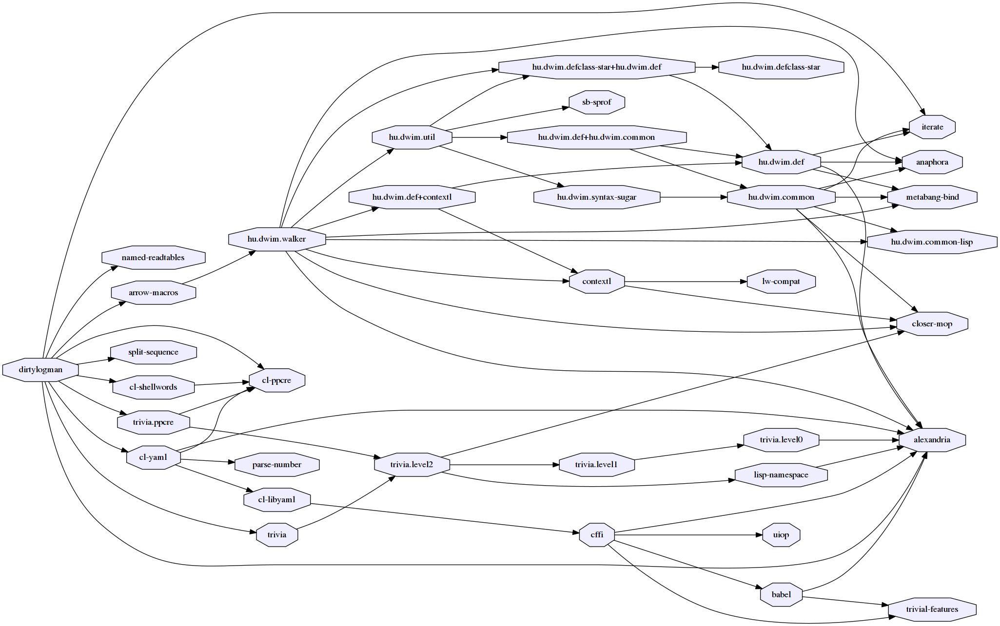

# Dirtylogman - Tools for reading lots of shitty, ill-formated log files

[](https://travis-ci.org/guicho271828/dirtylogman)

This is a tool for people who must deal with the programs written by those who
are not intelligent enough to get the idea of structured logs and spit random
printf messages (mostly college graduates or old fogey, and they are most likely
writing in C++).

## Usage

Assume you have to handle a bunch of terribly formatted log files. Could be your
fault, could be not. But it is certain that you have to parse some numbers out
of it and possibly make a graph or some sort, most likely using a dark magic of
shell script.

This lib is an experimental tool for replacing such a script. It is better
than a simple awk in a sense that it is easier to handle the common cases,
such as matching against the pathname and also providing a quick way to split a string
(in an inconsistent manner).

    dirty -y sample.yaml $(find -name "*.out" fig2-base)

To use this tool you need to provide a yaml configuration file
([here is the sample](sample.yaml)) which describes how to parse the log files.
In this file, each hash key defines a "variable" that simply
corresponds to a column in the resulting CSV.

There are special variables "pathname" and "secondary", where "pathname" is
automatically bound to the current filename and "secondary" specifies a list of
secondary files that is additionally read/analyzed and whose variables are also
included in the CSV row. Variables for the secondary files are separated by a
yaml multidoc separator `---`.


``` yaml
# fig2-base/ipc2008-opt-master-ad1e-a333af-2016-05-29-14-55/elevators-opt08/p01.ad1e.1800.4000000.out
# fig2-base/ipc2008-opt-master-ad1e-a333af-2016-05-29-14-55/elevators-opt08/p01.ad1e.1800.4000000.plan.1

pathname:
  [fig, mode, ipc, track, domain, problem, search, timelimit, memory]:
    - split fig - mode / ipc - track - * / domain / problem . search . timelimit . memory . *
    # equivalent:
    # - regex "([^-]*)-([^/]*)/([^-]*)-([^-]*)-[^/]*/([^/])*/([^.])*\.[^.]*\.([^.])*\.([^.])*.*"
  plan:
    - shell sed s/out/plan.1/g
time:
  # must be escaped because of the colon
  - 'like "Actual search time: 1.991e-05 (sec) [t=0.0441942 (sec)]" "1.991e-05"'
  # equivalent to
  # - shell "awk '/^Actual search time:/{print $4}'"
expansion:
  - like "Expanded 5 state(s)." "5"
  # equivalent to
  # - shell "awk '/^Expanded .* state(s)\.$/{print $2}'"
solution:
  - exists "Solution found!"
  # equivalent to
  # - shell "grep -q 'Solution Found!' ; echo $?"
count:
  - count "Solution found!"
  # equivalent to
  # - shell "grep -c 'Solution Found!'"
numline:
  - shell wc -l

secondary:
  - plan
  
---

cost:
  - like "; cost = 66 (general cost)" "66" :mode :around
```

Performance and scalability is the current concern.
Currently, the system should be very slow (I did not benchmarked it, though).

## Installation

+ `sudo apt install -y libyaml-0-2` (or equivalent)
+ Install [roswell](http://roswell.github.io/)
+ `ros install guicho271828/dirtylogman`

## Dependencies

This library is at least tested on implementation listed below:

+ SBCL 1.4.0 on X86-64 Linux 4.10.0-37-generic (author's environment)
+ CCL 1.9

Also, it depends on the following libraries:



(This figure is generated by [asdf-viz](https://github.com/guicho271828/asdf-viz))

## Installation

## Author

* Masataro Asai (guicho2.71828@gmail.com)

## Copyright

Copyright (c) 2017 Masataro Asai (guicho2.71828@gmail.com)

# License

Licensed under the LLGPL License.


