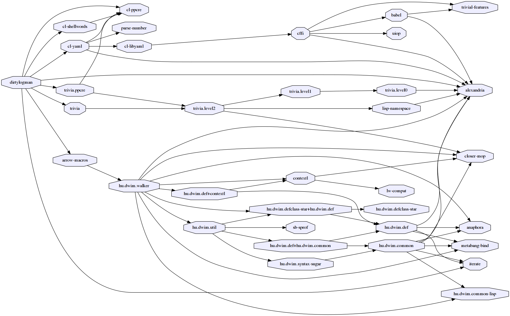

# Dirtylogman - Tools for reading lots of shitty, ill-formated log files

This is a tool for people who must deal with experimental tools that were
written by those who are not intelligent enough to get the idea of structured
logs and spit random printf messages (mostly college graduates or old fogey, and
they are most likely writing in C++).

## Usage

## Dependencies
This library is at least tested on implementation listed below:

+ SBCL 1.4.0 on X86-64 Linux 4.10.0-37-generic (author's environment)

Also, it depends on the following libraries:

(This figure is generated by [asdf-viz](https://github.com/guicho271828/asdf-viz))

## Installation

## Author

* Masataro Asai (guicho2.71828@gmail.com)

## Copyright

Copyright (c) 2017 Masataro Asai (guicho2.71828@gmail.com)

# License

Licensed under the LLGPL License.

